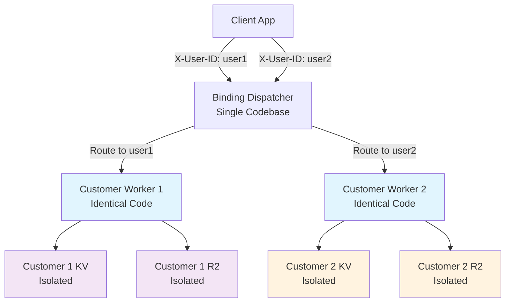

# Multi-Tenant Platform with Cloudflare Workers

A complete multi-tenant platform architecture demonstrating how to use Cloudflare Workers to extend D1, KV, R2, and other Cloudflare services to your end customers with complete isolation.

### Key Components

- **🚀 Dispatch Worker** (`my-binding-dispatcher/`) - Central routing service that routes requests to their dedicated workers
- **👤 Customer Workers** (`customer-worker-1/`, `customer-worker-2/`) - Isolated worker instances per customer with dedicated KV and R2 storage

## Benefits

✅ **Complete Isolation** - Each customer has their own worker runtime and storage namespaces  
✅ **Scalable** - Automatically scales per customer without shared resource contention  
✅ **Secure** - User-specific authentication with no cross-customer data access  
✅ **Extensible** - Easy to add new Cloudflare services (D1, Durable Objects, etc.)  
✅ **Cost-Effective** - Pay-per-use model with no idle resource costs  

### Worker Isolation Pattern

Each customer worker runs the same `UserWorker` class with the same methods:
- `uploadFile()`, `getFile()`, `deleteFile()` for R2 operations
- `setData()`, `getData()`, `deleteData()` for KV operations  
- `getStats()`, `listFiles()`, `listData()` for analytics

**The key difference**: Each worker instance is bound to **different underlying resources**:

```javascript
// customer-worker-1 bindings
{
  "USER_KV": "customer-1-kv-namespace",
  "USER_R2": "customer-1-files-bucket"  
}

// customer-worker-2 bindings  
{
  "USER_KV": "customer-2-kv-namespace",
  "USER_R2": "customer-2-files-bucket"
}
```

When `userWorker.setData('config', {theme: 'dark'})` is called:
- **Customer 1's worker** → writes to `customer-1-kv-namespace`
- **Customer 2's worker** → writes to `customer-2-kv-namespace`

Same code, but isolated execution environments.

### Request Flow

1. **Client Request** → Dispatcher receives request with `X-User-ID` header
2. **User Resolution** → Dispatcher routes request to the worker instance
3. **Isolated Execution** → Customer worker completes KV/R2 operation using the dedicated resources bound to that worker
4. **Response** → Results returned through dispatcher to client



## Resource-based operations (defined in the user worker)

### File Operations (R2)
- `POST /files` - Upload files with form-data (key, file)
- `GET /files?key=filename` - Download files
- `DELETE /files?key=filename` - Delete files

### Data Operations (KV)
- `POST /data` - Store JSON data `{key, value}`
- `GET /data?key=mykey` - Retrieve data
- `DELETE /data?key=mykey` - Remove data

### Analytics
- `GET /stats` - Get customer usage statistics
- `GET /` - Health check

### Example Usage

```bash
# Upload a file for user1
curl -X POST https://your-dispatcher.workers.dev/files \
  -H "X-User-ID: user1" \
  -F "key=logo.png" \
  -F "file=@logo.png"

# Store data for user2
curl -X POST https://your-dispatcher.workers.dev/data \
  -H "X-User-ID: user2" \
  -H "Content-Type: application/json" \
  -d '{"key": "settings", "value": {"theme": "dark"}}'

# Get user1 statistics
curl https://your-dispatcher.workers.dev/stats \
  -H "X-User-ID: user1"
```

## Quick Start

### 1. Deploy Customer Workers

```bash
# Deploy first customer worker
cd customer-worker-1
npm install
wrangler deploy

# Deploy second customer worker  
cd ../customer-worker-2
npm install
wrangler deploy
```

### 2. Configure Dispatcher

Update `my-binding-dispatcher/wrangler.jsonc` with your worker names:

```json
{
  "dispatch_namespaces": [{
    "binding": "DISPATCHER",
    "namespace": "bindings",
    "experimental_remote": true
  }]
}
```

### 3. Deploy Dispatcher

```bash
cd my-binding-dispatcher
npm install
wrangler deploy
```

### 4. Test the System

```bash
# Test dispatcher health
curl https://your-dispatcher.workers.dev/ \
  -H "X-User-ID: test-user"

# Upload a test file
curl -X POST https://your-dispatcher.workers.dev/files \
  -H "X-User-ID: test-user" \
  -F "key=test.txt" \
  -F "file=@test.txt"
```

## Configuration

### Customer Worker Configuration

Each customer worker needs:
- Unique KV namespace ID
- Unique R2 bucket name
- Same binding names (`USER_KV`, `USER_R2`)

Example `wrangler.jsonc`:
```json
{
  "name": "customer-worker-1",
  "kv_namespaces": [{
    "binding": "USER_KV",
    "id": "your-unique-kv-id"
  }],
  "r2_buckets": [{
    "binding": "USER_R2", 
    "bucket_name": "customer-1-files"
  }]
}
```

## Extending the Platform

### Adding D1 Database Support

1. Add D1 binding to customer workers:
```json
{
  "d1_databases": [{
    "binding": "USER_DB",
    "database_name": "customer-1-db",
    "database_id": "your-d1-id"
  }]
}
```

2. Add database methods to customer worker:
```javascript
async queryDatabase(sql, params) {
  return await this.env.USER_DB.prepare(sql).bind(...params).all();
}
```
Feel free to use this to build your own multi-tenant platforms!